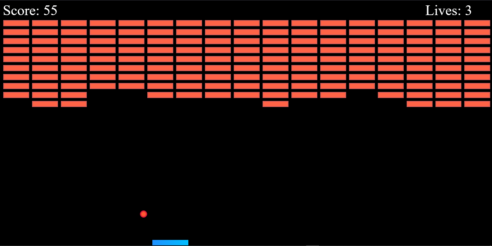

# Brick Breaker Game

This is a classic Brick Breaker game built with JavaScript, HTML, and CSS. It includes realistic ball physics and various power-ups, adding an extra layer of excitement to the gameplay. The objective is to break all the bricks on the screen using a paddle and a bouncing ball.


---

## Table of Contents

- [Features](#features)
- [Screenshots](#screenshots)
- [Game Mechanics](#game-mechanics)
- [Power-Ups](#power-ups)
- [Tech Stack](#tech-stack)
- [Installation](#installation)
- [Usage](#usage)
- [Contributing](#contributing)

---

## Features

- **Realistic Ball Physics**: The ball’s speed and angle of bounce are affected by the position and angle of the paddle, simulating realistic physics.
- **Power-Ups**: Gain different power-ups to enhance gameplay, such as increasing paddle size, multiple balls, slowing down ball speed, and more.
- **Multiple Levels**: Progress through different levels, each with unique brick arrangements and increased difficulty.
- **Score Tracking**: Keep track of your score as you break bricks.
- **Responsive Design**: Playable on desktop and mobile browsers.

---

## Screenshots

### Game Play

---

## Game Mechanics

- **Paddle Movement**: Control the paddle using keyboard arrow keys (or touch input on mobile).
- **Ball Physics**: The ball's movement changes dynamically based on paddle hits, brick collisions, and wall bounces.
- **Brick Breaking**: Each brick breaks upon impact, and certain bricks may require multiple hits.

---

## Power-Ups

During gameplay, certain bricks drop power-ups that affect the game. Some examples include:

- **Expand Paddle**: Increases paddle width for easier control.
- **Multi-Ball**: Adds more balls to increase the chances of breaking bricks.
- **Extra Life**: Adds an extra life for longer gameplay.

## Tech Stack

- **Frontend**: HTML5, CSS3, JavaScript (Vanilla JS)

---

## Installation

### Prerequisites
- Modern web browser (Chrome, Firefox, Safari, etc.)

### Steps

1. **Clone the Repository**

   ```bash
   https://github.com/bijuaryal91/BrickBreaker
   cd BrickBreaker

2. **Open the game**
 Simply open index.html in your preferred web browser to start playing.


## Usage
1. **Start Game**: Open the index.html file in your browser to access the game menu and click "Start Game".
2. **Move Paddle**: Use the left and right arrow keys to control the paddle.
3. **Collect Power-Ups**: Power-ups will randomly drop from broken bricks—collect them for additional effects.

## Contributing
1. Fork the repository
2. Create a new branch (git checkout -b feature-name)
3. Commit changes (git commit -m "Add new feature")
4. Push to the branch (git push origin feature-name)
5. Open a Pull Request
